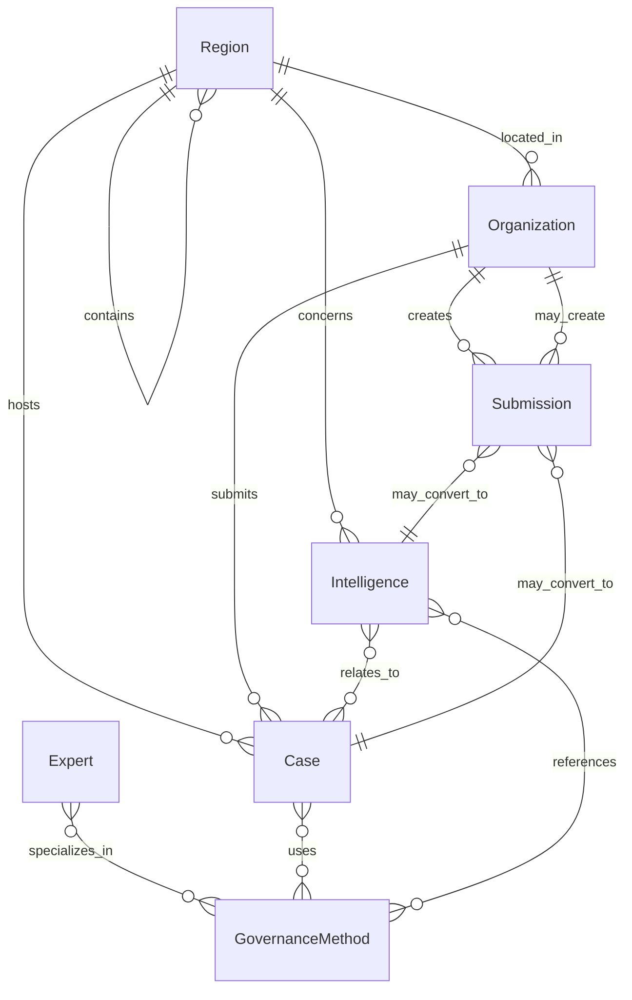

# Domain Model Governance

本文档定义《全国社区治理协同地图》的领域模型边界。当前阶段不设计数据库、不引入 ORM、不实现 API，只建立可持续扩展的产品语义层。

## 1. Core Entities

### Case

社区治理案例，是平台最核心的沉淀对象。

当前来源：`data/cases.json`

建议语义：

- `id`: 稳定唯一标识，建议使用 `case_` 前缀。
- `title`: 案例标题。
- `regionId`: 所属区域，替代直接散落的 `city`、`district` 字符串。
- `submitterOrganizationId`: 提交机构。
- `subjectType`: 提交主体类型，可迁移为 Organization 类型。
- `communityType`: 小区或社区类型。
- `problem`: 核心问题。
- `governanceMethodIds`: 治理方法集合。
- `actions`: 关键动作。
- `result`: 阶段成果。
- `risks`: 风险提示。
- `tags`: 展示和检索标签。
- `publishedAt`: 发布时间。
- `reviewStatus`: 审核状态。

### Organization

平台共建机构、提交主体、案例参与方、政策线索来源方。

当前状态：没有独立数据结构，散落在 `Case.submitter`、`Case.subjectType`、城市 `organizationCount` 中。

建议语义：

- `id`
- `name`
- `type`: 社工机构、物业公司、业委会、街道/社区、专家顾问、服务商、研究机构、其他。
- `regionId`
- `contactProfile`: 未来可承载联系人，但 MVP 不存敏感信息。
- `verifiedStatus`
- `participationRoles`: submitter、co-builder、source、reviewer。

### Region

全国协同网络的地理与行政区划基础。

当前来源：`data/cities.json` 内的 `province`、`name`、`x`、`y`。

建议语义：

- `id`
- `name`
- `type`: country、province、city、district、community。
- `parentRegionId`
- `displayCoordinate`: 演示地图坐标。
- `geoCode`: 未来接入行政区划时使用。
- `status`: active、pending、archived。
- `latestUpdate`

### Expert

治理专家、顾问、研究者、审核人或案例复盘参与者。

当前状态：没有独立实体，仅在提交身份中出现“专家顾问”。

建议语义：

- `id`
- `name`
- `organizationId`
- `expertiseMethodIds`
- `regionIds`
- `profileSummary`
- `publicVisibility`
- `reviewRole`: none、advisor、reviewer。

### GovernanceMethod

治理方法、机制或模式，是案例分类和知识沉淀的核心抽象。

当前状态：散落在 `categories.cases`、`Case.model`、`Case.tags`。

建议语义：

- `id`
- `name`: 信托制物业、老旧小区治理、财务公开等。
- `category`
- `description`
- `applicableProblems`
- `riskNotes`
- `relatedMethodIds`

### Intelligence

AI 行业情报条目，承载政策、城市案例、舆情、招投标、趋势等信息流。

当前来源：`data/intelligence.json`

建议语义：

- `id`
- `title`
- `category`
- `regionId`
- `sourceName`
- `sourceType`
- `summary`
- `aiSummaryStatus`: pending、generated、failed、needs_review。
- `tags`
- `publishedAt`
- `sourceUrl`
- `relatedCaseIds`
- `relatedMethodIds`
- `riskLevel`: none、low、medium、high，主要服务舆情风险。

### Submission

全国参与者提交的案例、政策线索、城市动态、舆情线索、城市共建申请。

当前状态：`/submit` 表单只保存在本地页面状态中，没有持久化数据。

建议语义：

- `id`
- `submissionType`
- `submitterName`
- `submitterPhone`
- `organizationName`
- `organizationType`
- `regionId`
- `title`
- `description`
- `relatedUrl`
- `attachmentRefs`
- `consentToPublishAfterReview`
- `reviewStatus`: submitted、reviewing、approved、rejected、converted。
- `convertedEntityType`: Case、Intelligence、Organization、Region。
- `convertedEntityId`
- `createdAt`

## 2. Entity Relationships

## 3. Naming Conventions

### Entity Names

Use singular PascalCase for domain entities:

- `Case`
- `Organization`
- `Region`
- `Expert`
- `GovernanceMethod`
- `Intelligence`
- `Submission`

### Field Names

Use camelCase:

- `publishedAt`
- `reviewStatus`
- `sourceUrl`
- `organizationType`
- `governanceMethodIds`

### ID Prefixes

Use stable, readable prefixes:

- `case_`
- `org_`
- `region_`
- `expert_`
- `method_`
- `intel_`
- `submission_`

### Status Values

Use English lowercase enum values in data and map them to Chinese labels in UI:

- `active`, `pending`, `archived`
- `submitted`, `reviewing`, `approved`, `rejected`, `converted`
- `generated`, `pending`, `failed`, `needs_review`

### Avoid

- Do not mix Chinese display labels and domain enum values as the same field.
- Do not use city names as foreign keys.
- Do not encode business status only in tags.
- Do not let `tags` become the only categorization mechanism.

## 4. Future Extension Points

### Review Workflow

`Submission.reviewStatus` can later drive manual review, AI pre-review, and publish approval.

### Knowledge Graph

`Case`、`GovernanceMethod`、`Intelligence` can form a graph:

- A policy intelligence item may relate to multiple methods.
- A case may prove one method and expose risks for another.
- A city may show method adoption density.

### Region Hierarchy

Move from flat city records to:

- Country
- Province
- City
- District
- Community

This allows national maps, provincial views, city pages, and district-level case clusters.

### Organization Network

Organizations should eventually support:

- co-builder roles
- submitting history
- verified status
- region coverage
- relationship to experts

### Expert System

Experts should not become a course/credential system in MVP. Their first role is:

- case review
- method annotation
- city governance advisory

### AI Intelligence Pipeline

`Intelligence.aiSummaryStatus` and `sourceType` allow future AI ingestion without changing UI semantics.

## 5. Current JSON Structure Risks

### Case Risks

- `city` and `district` are plain strings, so filtering and relationships rely on exact text match.
- `submitter` is a string, preventing organization profile reuse.
- `subjectType` duplicates future Organization type semantics.
- `model` is free text while `tags` also carry method semantics; method classification may drift.
- `status` is currently mixed with review meaning but named too generally.

### City Risks

- `cities.json` currently mixes Region, platform statistics, map coordinate, and latest activity.
- `caseCount`、`policyCount`、`organizationCount` are denormalized demo numbers; they may diverge from real Case, Intelligence, and Organization data.
- `status` is only `active/pending`; future needs may include suspended, archived, pilot, verified.
- `x/y` are presentation coordinates, not geographic data.

### Intelligence Risks

- `region` and `city` are strings; national and regional intelligence may be hard to connect to Region hierarchy.
- `url` uses `#`, which is acceptable for demo but must not be treated as source integrity.
- `aiSummaryStatus` only has `generated` in current data, so failure and review states are not represented.
- `category` uses Chinese display labels directly.

### Categories Risks

- `categories.cases` mixes taxonomy, methods, and topics.
- `identities` duplicates future Organization type.
- `submissionTypes` is UI-facing and domain-facing at the same time.

### Stats Risks

- `stats.json` is hand-authored and detached from actual data.
- Counts can conflict with real list length, e.g. demo city count 128 while city records are 10.
- This is acceptable as keynote-style demo data, but should be clearly labeled as platform metrics, not derived facts.

## 6. Governance Recommendation

Keep JSON for MVP, but introduce a domain vocabulary before adding more features:

- Add domain docs first.
- Keep UI labels separate from enum values.
- Treat current JSON as presentation mock, not canonical data.
- Before adding database or API work, define canonical TypeScript domain types in one place.
- Before adding a new page, define which entity it reads, creates, or converts.
