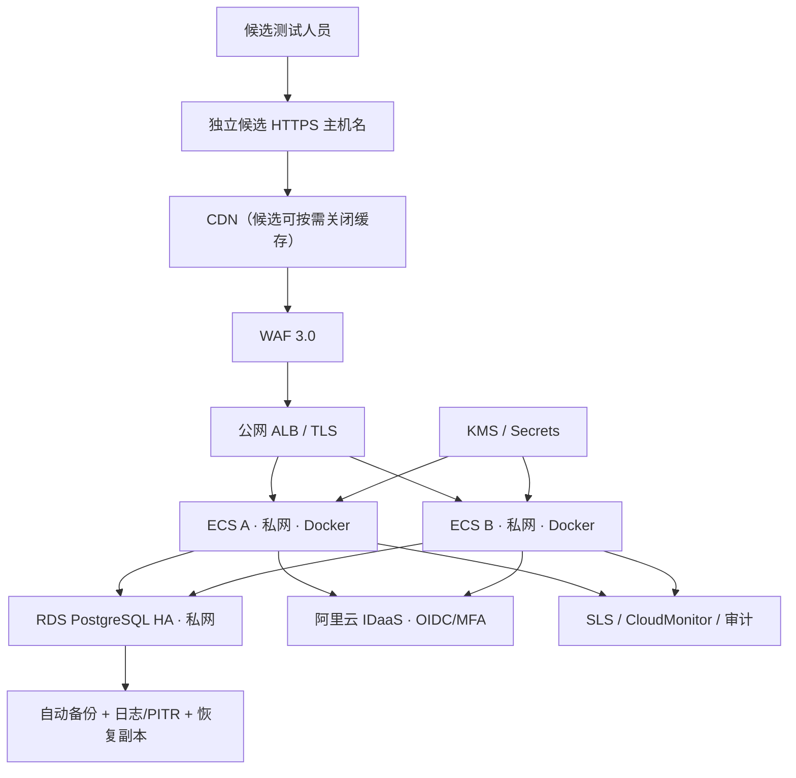

# 国内云候选生产架构实施方案 V1.0

## 一、实施状态

```text
architecture_implementation_plan_ready = true
candidate_application_package_ready = true
alibaba_cloud_account_authenticated = false
remote_resources_created = false
production_candidate_ready = false
```
本方案已形成仓库内可部署候选包，但阿里云控制台当前未登录，尚无 ECS、ALB、RDS、IDaaS、KMS、SLS、WAF 或备份资源 ID。不得把设计和本地构建描述成远程环境已建立。

## 二、候选网络架构



候选 VPC 建议使用独立地址段，例如 `10.30.0.0/16`，实际 CIDR 在创建前核对现有网络，避免与办公网、Staging 或未来专线冲突。

| 网络区域 | 建议 | 访问边界 |
|---|---|---|
| ALB 接入 | 两可用区 | 只开放 443；80 仅用于重定向到 HTTPS |
| 应用 vSwitch A/B | 两可用区私网 | 仅允许 ALB 安全组访问容器端口 3000 |
| RDS | 与应用同地域、跨可用区高可用 | 仅允许应用安全组访问 5432，禁止公网地址 |
| 管理面 | Cloud Assistant/堡垒机/RAM | 禁止公网 SSH；紧急访问需具名审批与 MFA |
| 出站 | 最小化 NAT/公网出站 | 只允许 IDaaS、软件源、监控等已批准目标 |

## 三、计算资源

### 候选构建

- `Dockerfile` 使用 Node.js `24.13.0-bookworm-slim` 多阶段构建；
- Next.js `output: standalone`；
- 运行用户为非 root `nextjs`；
- 镜像只包含 standalone server、静态资源和运行依赖；
- build arg 只允许非敏感 `NEXT_PUBLIC_SITE_URL`；
- Production Secret 禁止作为 build arg 或写入镜像；
- 镜像以 commit SHA 固定 tag，并记录 ACR digest；禁止以 `latest` 作为发布依据。

### ECS 建议

| 场景 | 规格建议 | 用途 |
|---|---|---|
| 工程候选 | 1 × 2 vCPU / 4 GiB | 构建与基本部署验证，不证明高可用 |
| 发布等价候选 | 2 × 2 vCPU / 4 GiB，跨可用区 | ALB、滚动发布、故障摘除与容量验证 |

容器启动命令为 `node server.js`，监听 3000。ALB 存活检查使用 `/api/health/live`；数据库就绪检查使用 `/api/health/ready`。

## 四、数据库方案

- RDS PostgreSQL 高可用版，优先验证 PostgreSQL 16；如地域/扩展不兼容则使用经批准版本；
- 独立候选实例、数据库、账号和参数组，不与 Staging 共用；
- 应用账号仅拥有合作 schema 必需 DML 权限；migration 账号独立、短时授权；
- 强制 TLS、私网连接、安全组白名单和连接池上限；
- 部署 `db/cooperation/001_initial.sql` 六表 schema；
- COL 使用数据库原子 UPSERT，候选测试使用独立年份/编号空间或测试标记，绝不导入真实历史记录；
- 审计表 UPDATE/DELETE 由触发器拒绝。

候选远程验证必须包括两轮：schema → 合成数据 → 备份 → 恢复到新实例/副本 → 数量、关系、COL、审计复核。

## 五、存储与镜像

| 对象 | 存储 | 控制 |
|---|---|---|
| 容器镜像 | 阿里云 ACR | 私有仓库、漏洞扫描、不可变 digest、RAM 最小权限 |
| 数据库备份 | RDS 自动备份/日志备份 | 保留策略、PITR、恢复演练、删除保护 |
| 离站备份 | OSS/DBS 或批准的跨地域存储 | KMS 加密、与 DBA 权限分离、哈希清单 |
| 应用日志 | SLS | 脱敏、保留期、只读审计角色、费用告警 |
| 构建产物 | CI/ACR | SHA 与 digest 绑定，不保存 Secret |

## 六、身份与安全组件

### 身份

候选生产使用阿里云 IDaaS 或经批准的国内 OIDC 提供方：

```text
OIDC Authorization Code + PKCE
→ issuer/audience/signature/nonce/state 验证
→ IDaaS MFA/TOTP claim 验证
→ subject_id 映射 cooperation_admin_user
→ 服务端 RBAC
→ 追加式审计
```

仓库已保留 `supabase`（Staging）和新增 `oidc`（国内候选）双提供方适配。两者的用户、Session、Secret 和角色映射不可共用。

### 安全组件

- WAF：公开登记、登录和 API 规则分层；动态提交与管理 API 禁止 CDN 缓存；
- KMS/Secrets：RDS URL、OIDC client secret、既有后台 Secret 分别存储和轮换；
- RAM：主账号只作应急，部署、数据库、日志、安全和账单使用具名子账号；
- SLS/CloudMonitor：5xx、提交失败、就绪失败、登录拒绝、越权、COL 冲突和备份失败告警；
- HTTPS：TLS 1.2+，证书自动续期；候选不得使用正式主域；
- 数据保护：日志不得记录电话、微信、邮箱、密码、Token、TOTP Secret 或数据库连接串。

## 七、备份与恢复

待批准目标：

```text
RPO <= 15 minutes
RTO <= 2 hours
```

实施要求：

1. 自动数据备份与日志备份/PITR；
2. schema 变更前手动恢复点；
3. 加密离站/跨地域备份；
4. 每次候选发布前恢复到新实例验证；
5. 恢复后复核六表、外键、重复 COL、最大/下一编号和审计不可变；
6. 记录实际恢复耗时和数据窗口。

阿里云 RDS PostgreSQL 官方说明支持自动/手动备份、日志备份与 PITR；真实规格、保留期和地域能力仍须在控制台创建前核对。[官方备份文档](https://help.aliyun.com/en/rds/apsaradb-rds-for-postgresql/back-up-an-apsaradb-rds-for-postgresql-instance)

## 八、仓库实施清单

已完成：

- `Dockerfile`、`.dockerignore`、standalone 输出；
- `/cooperation` 正式根入口；
- `/api/health/live` 与 `/api/health/ready`；
- 国内 OIDC/IDaaS 授权码 + PKCE 适配；
- MFA claim、issuer、audience、nonce、state、JWKS 签名校验；
- 候选环境静态隔离检查；
- 仅使用合成数据的 schema/COL/审计验证；
- 阿里云候选部署说明与环境变量模板。

未完成：

- 阿里云账号登录、实名认证/企业主体、预算和计费确认；
- VPC、ECS、ACR、ALB、RDS、IDaaS、KMS、SLS、WAF、CDN 和备份资源创建；
- Docker 镜像实际构建/运行（当前机器无容器运行时）；
- 远程应用、RDS、IDaaS、MFA、网络、HTTPS、日志和恢复验证。

## 九、当前结论

```text
candidate_architecture_defined = true
candidate_code_package_ready = true
candidate_remote_infrastructure_ready = false
production_candidate_ready = false
```
