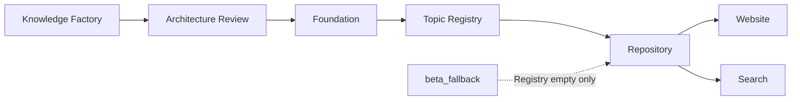

# ENG-024｜Foundation Integration Sprint 1 Review

## 本次完成

- 将 `lib/repositories/topics.ts` 建立为 Website 唯一 Topic 数据入口。
- 新增统一 Topic Model：ID、slug、标题、subtitle、summary、status、releaseLevel、sections、evidence、updatedAt，并保留 ENG-023 类型兼容别名。
- 新增 `config/foundation/topic-registry.v1.json` 作为正式 Topic 单一注册中心。
- 实现 Foundation-first Provider：Registry 有数据时只展示 `approved + Website Ready`；Registry 无数据时才启用 `beta_fallback`。
- Search 页面改用 `searchTopicRepository()`，覆盖 Title、Keyword、Topic 与公开 Foundation Object，并保留 `includeFullText` 接口。
- 新增非阻断 Registry Validation、CLI 和四组集成测试。
- 保留 Knowledge First UI 基线，没有修改样式、页面结构或路由。

## 当前 Foundation 状态

Foundation 当前有 7 个 approved / Foundation Ready Knowledge Object，但没有正式登记的 Topic Release Record：

- Website Ready Topic：0
- Foundation Ready Topic：0
- Topic Registry 有效记录：0

因此 Repository 正确发出 `EMPTY_REGISTRY` Warning，并启用已有 `beta_fallback`。这是数据现状，不是工程失败。ENG-024 没有把 Candidate 或单个 approved JD 自动提升为正式 Topic。

## 技术问题与处理

1. **Foundation Object 与 Topic Release Level 不是同一状态。** 通过独立 `status + releaseLevel` 模型和显式 Release Gate 避免自动推断。
2. **现有 Beta Catalog 缺少新模型字段。** Repository 在边界内规范化为 `in_review + Candidate`，未修改原 Topic 内容。
3. **坏 Registry 记录不能阻断网站。** Validator 对非法状态安全降级，对缺失 Section 补空，对缺少身份或重复记录跳过并输出 Warning。
4. **Search 原先跨多个 Repository 拼装。** 现统一由 Topic Repository 协调 Topic 与公开 Foundation Object；旧函数保留 deprecated wrapper，避免兼容性破坏。

## 推迟到下一 Sprint

- 首个正式 Topic Registry 记录：必须等待 Chief Architect 批准 Topic Release Record。
- 真正全文索引、分词、相关度与高亮。
- Foundation HTTP API、增量索引与缓存失效机制。
- Release Level 管理界面或写入流程；本 Sprint 只读，不越权修改 Foundation。

## Validation Summary

```text
npm run beta:test                 PASS（13/13）
npm run foundation:topic:validate PASS（0 error，1 expected warning）
npx tsc --noEmit                 PASS
npm run build                    PASS（50/50 pages）
```

Expected Warning：`EMPTY_REGISTRY`。原因是当前没有经过 Architecture Review 的正式 Topic Registry 记录。

## Foundation Integration Diagram



## 下一 Sprint 建议

在 Chief Architect 批准首个 Topic Release Record 后，执行 Foundation Integration Sprint 2：登记首个 `Website Ready` Topic，验证 fallback 自动退出、Foundation Object canonical link 校准、搜索索引同步与发布回滚全过程。
