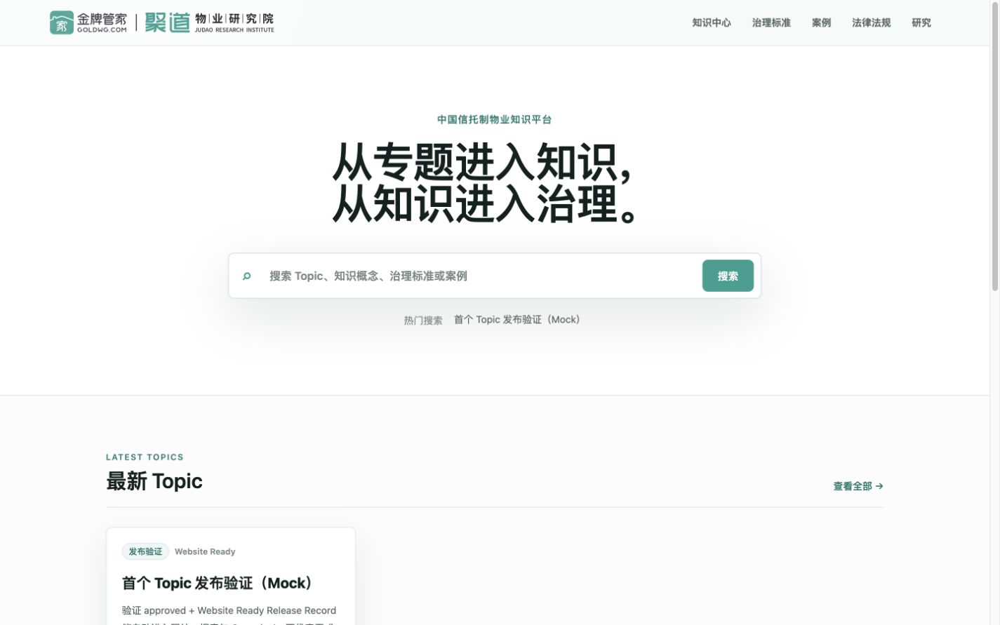
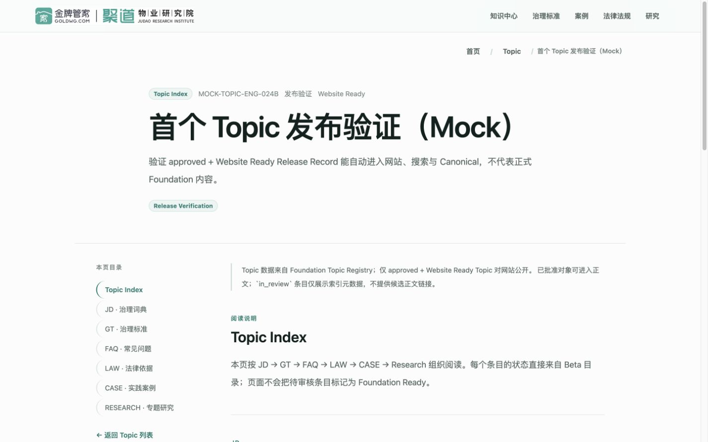
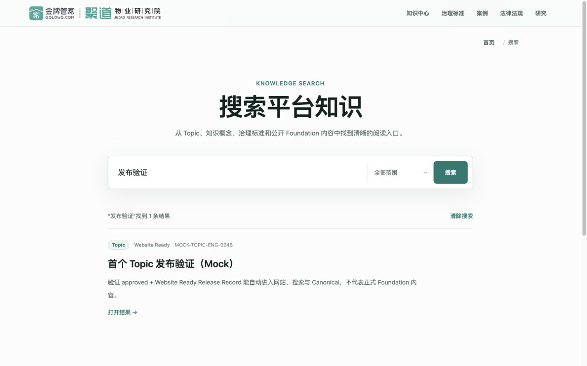
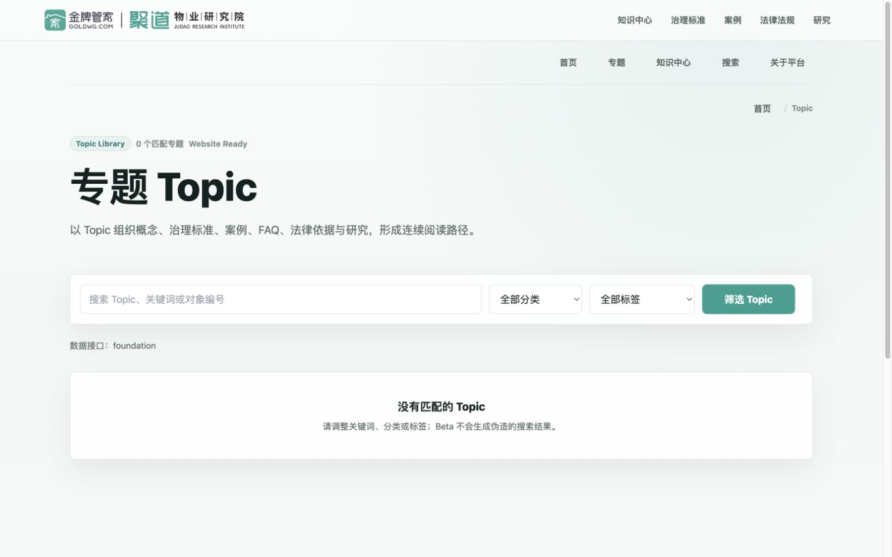
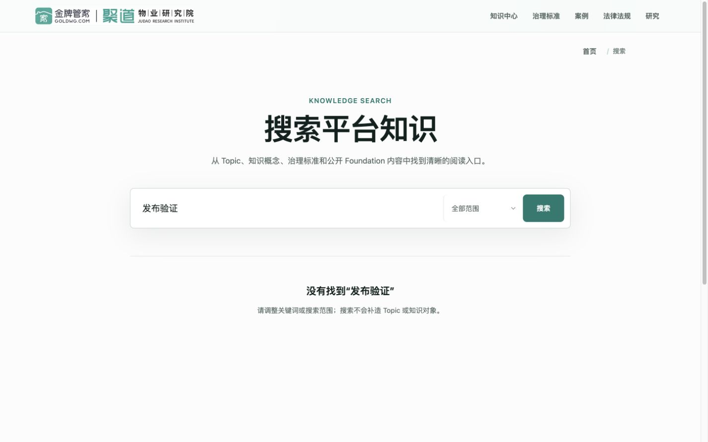
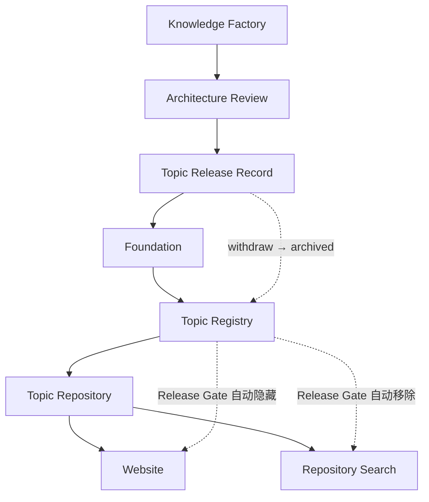

# ENG-024B｜First Topic Release Verification Report

> 验证日期：2026-07-17
>
> 验证范围：Release Record → Foundation Topic Registry → Repository → Website / Search
>
> 数据声明：本报告使用 `tests/fixtures/` 下明确标注 `verificationOnly` 的 Mock Release Record。它不是正式 Foundation 数据，也没有写入正式 Topic Registry。

## 1. 验证结论

ENG-024B 验证通过。现有工程无需修改 Repository、Website 页面或 Search，即可由一个正式结构的 Topic Release Record 驱动发布；撤回时只改变生命周期、不删除 Registry 记录，Website 与 Search 会自动停止公开该 Topic。

| 验证项 | 结果 | 证据 |
| --- | --- | --- |
| Release Record 接口 | PASS | Mock Record 通过现有 `validateTopicRegistry()`，六类 Section 与统一 Topic Model 均被接受 |
| 自动退出 beta fallback | PASS | Registry 有 1 条记录时页面显示 `数据接口：foundation`，未出现 fallback Topic |
| Home / Topic List / Detail | PASS | 首页 Latest Topic、列表与详情均自动出现 Mock Topic，页面代码未修改 |
| Canonical | PASS | 由 slug 自动生成 `/topics/eng-024b-release-verification` |
| Repository Search | PASS | Title、Keyword、Topic 查询均检索到 Mock Topic，Search 代码未修改 |
| Rollback | PASS | 同一记录改为 `archived` 后，Registry 仍有 1 条；Website、Search 隐藏，详情返回 404 |
| 撤回后 fallback 状态 | PASS | Topic List 仍显示 `数据接口：foundation` 且为 0 条，没有重新展示 beta fallback |
| 正式数据隔离 | PASS | `config/foundation/topic-registry.v1.json` 仍为 0 条；Mock 仅存在于测试夹具 |

## 2. 验证方法

验证在由当前 Commit 创建的隔离临时副本中执行。测试过程只把 Mock fixture 临时复制到该副本的 Registry 路径；工作区正式 Registry、Foundation 数据、知识对象与页面源码均未修改。

发布态：

1. 注入 `topic-release-record.mock.json`；
2. 启动现有 Website；
3. 检查 Home、Topic List、Topic Detail、Search；
4. 读取详情页 `link[rel=canonical]`；
5. 确认 Topic List Provider 为 `foundation`。

撤回态：

1. 用同 ID、同 slug 的 `topic-release-record-withdrawn.mock.json` 替换隔离副本中的验证记录；
2. 仅把 lifecycle 从 `approved` 改为 `archived`，不删除记录；
3. 重启现有 Website；
4. 确认列表与搜索不再显示 Topic，详情返回 404；
5. 确认 Provider 仍为 `foundation`，因此 fallback 未重新启用。

## 3. 自动化断言

`tests/topic-release-verification.test.ts` 固化以下行为：

- 正式 Registry 保持为空，Mock 明确标注为验证专用；
- `approved + Website Ready` 是唯一公开 Gate；
- Registry 非空即退出 beta fallback；
- Canonical path 由稳定 slug 派生；
- Repository 查询支持 Title / Keyword / Topic；
- `archived` 记录继续保留，但公开集合与搜索结果均为 0。

## 4. 页面证据

发布后首页 Latest Topic：

发布后 Topic Detail：

发布后 Repository Search：

撤回后 Topic List（Provider 仍为 Foundation，0 条）：

撤回后 Search：

## 5. 架构闭环

职责与后续演进见《Foundation Integration Architecture V1.0》。本次只增加 Release Record 节点与撤回语义，没有新增平台标准。

## 6. 数据与变更边界

- 未修改 UI、路由、Repository、Search 或 Foundation Engine；
- 未修改 Topic 内容、知识对象、平台标准或正式 Foundation 数据；
- 未把 Mock Record 加入 `config/foundation/topic-registry.v1.json`；
- README 已把“深色首页”和旧 Provider 描述更新为当前 Knowledge First / Foundation Repository 实际状态。

## 7. 工程验证结果

| 检查 | 结果 |
| --- | --- |
| Beta / Website tests | PASS，16/16 |
| Foundation Engine tests | PASS，7/7 |
| Foundation Engine validation | PASS，0 error；14 条既有 data notice |
| Formal Topic Registry validation | PASS，0 条正式 Topic；1 条预期 `EMPTY_REGISTRY` warning |
| TypeScript | PASS，`tsc --noEmit` 0 error |
| Production Build | PASS，50/50 static pages generated |

本 Sprint 没有新增运行时 warning。`EMPTY_REGISTRY` 是公开 Beta 尚未收到正式 Topic Release Record 时的预期状态；14 条 Foundation data notice 为既有知识数据提示，不属于 ENG-024B 工程变更。
