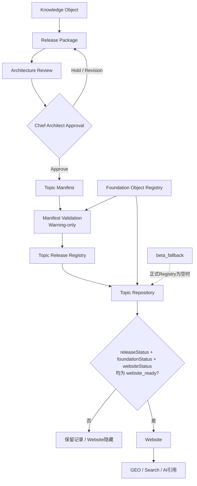

# ENG-025 Release Pipeline Diagram

> 工程图，不构成知识批准或发布决议。

## 状态门禁

| `releaseStatus` | Foundation | Website | 结果 |
| --- | --- | --- | --- |
| `draft` | `in_review` | `hidden` | 仅编辑与校验 |
| `foundation_ready` | `foundation_ready` | `hidden` | 已入Foundation，不公开 |
| `website_ready` | `foundation_ready` | `website_ready` | Repository允许Website读取 |
| `archived` | `archived` | `archived` | 保留记录，从Website撤回 |
