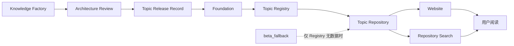
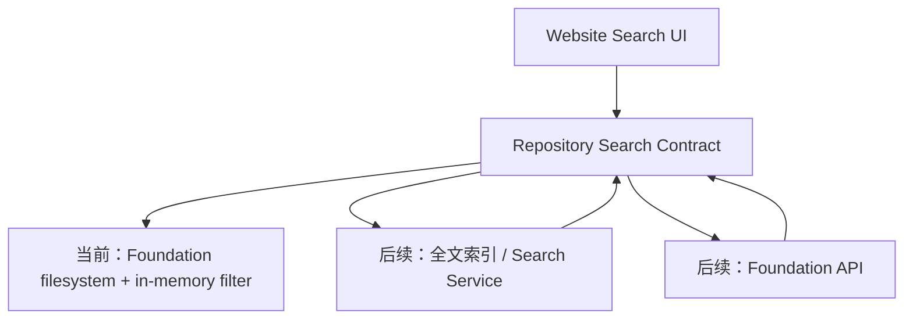

# Foundation Integration Architecture V1.0

> 文档性质：ENG-024 工程设计说明，不是平台标准，不定义或批准知识内容与 Topic Release Level。

## 1. 目标与边界

Foundation Integration 的目标，是让 Website 通过稳定的数据边界读取 Foundation，而不是让页面理解 Foundation 文件结构。完整数据流为：



本次接入不改变 Knowledge Factory、Architecture Review 或 Foundation 的治理职责，也不推定任何 Topic 已获得批准。Topic Release Record 是 Architecture Review 批准结果进入 Foundation 与 Topic Registry 的显式工程接口。当前 Foundation 有已批准知识对象，但正式 Topic Registry 仍为 0；Repository 因此按明确规则启用 `beta_fallback`。

## 2. 三层职责

### Foundation

Foundation 是已批准知识对象和未来已批准 Topic 的权威工程来源，负责稳定身份、生命周期、版本、关系、Evidence 与 Foundation Ready 状态。Foundation 不负责页面布局、筛选交互或搜索结果展示。

Knowledge Factory 生产的 Candidate 只有经过 Architecture Review，并形成明确 Release Record 后，才能登记相应 Release Level。Repository 不从对象数量、覆盖率或文件存在状态自动推断 Topic Level。

### Topic Repository

`lib/repositories/topics.ts` 是 Website 的唯一 Topic 数据入口，负责：

- 读取 `config/foundation/topic-registry.v1.json`；
- 把 Registry 数据规范化为统一 Topic Model；
- 使用公开 Foundation Object 校准对象标题、状态和 canonical URL；
- 只向网站返回 `approved + Website Ready` Topic；
- Registry 没有 Topic 数据时启用 `data/beta-topics.json`；
- 提供 Latest、Popular、Detail 与 Repository Search；
- 把 Validation Warning 返回工程观察层，而不是让页面崩溃。

Repository 也是反腐层：页面不需要知道 Registry JSON、Foundation 索引、Markdown 路径或 fallback 文件的位置。未来数据源变化只修改 Repository Adapter，不修改页面。

### Website

Website 负责呈现 Repository 已决定可以展示的数据，包括 Home、Topic List、Topic Detail 和 Search。页面不读取 Mock、JSON 或 Markdown 文件，不判断知识是否批准，也不自行生成 Title、Section、Evidence 或 Release Level。

Website UI 基线已冻结。Foundation 更新通过 Repository 自动反映到页面，不要求重新设计页面。

## 3. Topic Model 与 Release Gate

Repository 输出的 Topic 最低契约包括：

| 字段 | 工程用途 |
| --- | --- |
| `id` / `slug` | 稳定身份与 URL |
| `title` / `subtitle` / `summary` | 页面标题与检索摘要 |
| `status` | Topic 生命周期 |
| `releaseLevel` | Candidate / Foundation Ready / Website Ready |
| `sections` | JD、GT、FAQ、LAW、CASE、RESEARCH 阅读结构 |
| `evidence` | Evidence 引用接口 |
| `updatedAt` | 更新排序与缓存失效依据 |
| `categoryId` / `tagIds` / `keywords` | 分类、标签与 Repository Search |

Release Gate 是显式判断：只有 `status = approved` 且 `releaseLevel = Website Ready` 的 Foundation Topic 才会被 Website Provider 返回。`Foundation Ready` 不等于已经公开；`Candidate` 也不会因为引用了 approved JD 而自动升级。

`beta_fallback` 是开发期容错源，不是 Foundation。它只在 Registry 没有有效 Topic 数据时启用，输出统一模型并保持 `Candidate` 标记。Registry 一旦出现正式 Topic 数据，fallback 整体退出，不与 Foundation Topic 混合。

### Release Record 与撤回

获批 Release Record 以 `approved + Website Ready` 登记后，Repository 自动向 Home、Topic List、Topic Detail 与 Search 暴露该 Topic；Canonical URL 由稳定 `slug` 派生，不需要另行维护页面配置。撤回时保留同一 Registry 记录并把生命周期改为 `archived`，Release Gate 自动从 Website 和 Search 移除该 Topic。由于 Registry 仍非空，撤回不会误触发 beta fallback。

## 4. Validation 与故障隔离

Topic Registry Validation 检查：

- 缺少 `id`、`title`、`slug`；
- 缺少 Section；
- 非法 lifecycle status 或 releaseLevel；
- 重复 ID 或 slug；
- Website Ready Topic 引用未公开 Foundation Object。

校验原则是“Warning + 安全降级”：无法识别的状态按 `draft / Candidate` 处理；缺失 Section 补为空结构；缺少稳定身份或发生重复的记录不进入 Website。单条坏记录不会使 Next.js Build 或运行时崩溃。

可独立执行：

```bash
npm run foundation:topic:validate
```

## 5. Search、知识库与 API 演进

ENG-024 的 Search 已进入 Repository，覆盖 Topic 的 ID、Title、Summary、Keyword 和 Section Object，以及公开 Foundation Object 的 ID、Title、Summary、Category 与 Tag。`includeFullText` 是保留接口，默认不要求页面扫描 Markdown 正文。

后续演进保持页面契约不变：



建议演进顺序：

1. Foundation 产生首个获批 Topic Release Record，并登记 Registry。
2. 为 Topic 与 Knowledge Object 生成可增量更新的搜索文档。
3. Repository Adapter 接入全文索引，保留现有 `searchTopicRepository()` 返回结构。
4. Foundation API 稳定后，把文件读取替换为 API Client；Website 不感知迁移。
5. 增加缓存版本、索引健康检查、发布回滚与监控指标。

这种 Repository 模式避免页面绑定文件系统，也避免未来接入数据库、搜索引擎或 API 时发生第二次页面重构。
