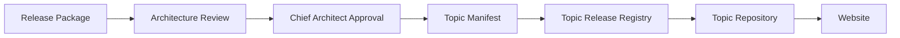
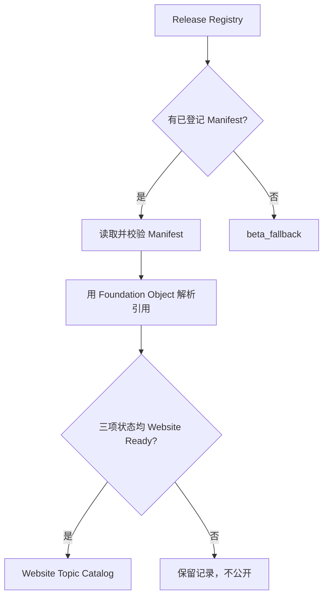

# Topic Manifest Engineering Guide V1.0

> 文档性质：ENG-025工程指南。本文说明发布流水线的数据边界与操作方式，不是知识对象标准、Topic发布标准或知识内容批准记录。
>
> 版本：V1.0　状态：Engineering Baseline　更新：2026-07-17

## 第1页｜为什么需要 Topic Manifest

### 1.1 解决的问题

Release Package是Knowledge Factory提交给Architecture Review的完整审核材料，包含专题说明、对象清单、Evidence状态、Checklist和待审批事项。它适合人阅读和决策，但不是稳定的Website数据契约。如果页面直接读取Release Package，页面就必须理解Markdown结构、审核表格和候选对象状态；每次材料格式变化都可能影响网站。

Topic Manifest位于批准决议与Website之间，只记录一次发布所需的稳定事实：Topic身份、URL、摘要、版本、发布状态、Release Record和所引用的Foundation Object。它不复制知识正文，也不重新作出批准判断。由此形成单向数据流：审核结果先落为Manifest，Registry只登记Manifest，Repository再把Manifest转换为Website既有Topic Model。



### 1.2 唯一发布对象

ENG-025之后，正式Topic发布不再由页面配置、对象数量或目录存在状态推断。Website只从Repository取得Topic，Repository优先读取Release Registry登记的Manifest。只有Manifest同时满足：

- `releaseStatus = website_ready`；
- `foundationStatus = foundation_ready`；
- `websiteStatus = website_ready`；

才会被转换为Website Ready Topic。`draft`、`foundation_ready`和`archived`记录可以继续留在发布链路中，但不会公开。这个门禁使批准、入库、公开和撤回都成为显式状态变化。

---

## 第2页｜Manifest、Release Package与Foundation Object的边界

### 2.1 三类对象的职责

| 对象 | 回答的问题 | 包含内容 | 不承担 |
| --- | --- | --- | --- |
| Release Package | 这个Topic是否应当批准 | 审核材料、Evidence、Checklist、建议 | Website运行时数据契约 |
| Foundation Object | 被引用的知识是什么 | JD、GT、CASE、FAQ、LAW、RESEARCH及其版本和生命周期 | Topic发布编排 |
| Topic Manifest | 哪个已审核Topic以什么状态引用哪些对象 | 身份、slug、版本、状态、Release Record、对象ID | 知识正文与新的制度判断 |

Manifest中的`objects`只保存稳定Object ID。它不内嵌JD、GT或CASE正文，也不复制对象Lifecycle。Repository用Foundation公开对象解析标题和canonical URL；对象尚未进入Foundation时，Validator给出Warning。这样可以防止Release Registry演变为第二套知识库。

### 2.2 Manifest Schema

Schema位于`foundation/topic-manifests/schema/topic-manifest.schema.json`。最低字段如下：

```json
{
  "id": "topic001",
  "slug": "common-entrustment",
  "title": "共同委托",
  "summary": "",
  "releaseStatus": "draft",
  "foundationStatus": "in_review",
  "websiteStatus": "hidden",
  "version": "1.0.0",
  "releaseRecord": "",
  "updatedAt": "2026-07-17",
  "objects": ["JD006", "BK1-JD-026", "BK1-GT-001"]
}
```

Schema使用`additionalProperties: true`，允许以后增加GEO、语言版本、发布渠道或缓存标识。现有必需字段的语义和四个`releaseStatus`值保持稳定；Reader对缺失的可选字段提供默认值，并继续兼容ENG-024的旧式内嵌Topic Record，便于渐进迁移。

### 2.3 Topic001当前边界

`foundation/topic-manifests/topic001.json`是未登记的Draft Manifest，用于承接已提交Release Package，不是正式Foundation数据。它保持`in_review / hidden`，且Release Record为空；Validator因此会明确提示尚缺批准记录和未入Foundation对象。正式Registry仍为空，不会导致Topic001提前公开。

---

## 第3页｜Registry、Repository与Validation

### 3.1 Release Registry

`config/foundation/topic-registry.v1.json`从保存完整Topic/Object集合改为保存Manifest路径：

```json
{
  "schemaVersion": "2.0",
  "manifestRoot": "foundation/topic-manifests",
  "manifests": []
}
```

Registry只承担登记、顺序和发现职责。Draft Manifest可以独立存在，但只有在Chief Architect批准并完成Foundation步骤后，才把路径加入`manifests`。测试用Mock Registry和Mock Manifest均位于`tests/fixtures/`，永不写入正式Registry。

### 3.2 Repository读取顺序



页面仍只调用`lib/repositories/topics.ts`，无需知道Manifest或JSON路径。Repository会阻止越出仓库根目录的路径，隔离单个文件读取错误，收集Warning，并把合法Manifest转换为现有Topic Model。重复ID或slug的记录不进入Website；其他内容问题不使Build失败。

### 3.3 Warning-only Validation

运行`npm run topic-manifest:validate`检查：

- Manifest引用对象未进入Foundation Registry；
- 同一Manifest内对象重复；
- 空标题或缺少稳定ID、slug；
- 非法release、Foundation或Website状态；
- 多个Manifest使用重复slug或ID；
- 缺少Release Record；
- Manifest未进入正式Release Registry。

校验输出Warning但不设置失败退出码。发布人员必须阅读Warning并在批准前处理；Build不会因为Candidate或未登记Draft存在而中断。结构性TypeScript错误、测试失败和Build失败仍属于工程失败，不受Warning-only原则影响。

---

## 第4页｜发布、撤回与批量演进

### 4.1 单个Topic发布步骤

1. Knowledge Factory提交Release Package，不直接修改Website。
2. Architecture Review逐项确认知识对象、Evidence、Metadata和发布等级。
3. Chief Architect形成可追溯Release Record。
4. Platform Engineering依据决议更新Manifest的对象ID、版本与三项状态。
5. Manifest路径加入正式Release Registry。
6. 执行Manifest Validation、TypeScript、测试和Build。
7. Repository自动读取，Website无需人工创建或修改页面。

撤回时不删除Manifest或Registry记录，而把`releaseStatus`和`websiteStatus`改为`archived`。Repository随即从Website与Search隐藏Topic，同时保留历史身份、版本和Release Record，支持审计与后续恢复。

### 4.2 批量发布支持

Registry的`manifests`数组天然支持批量登记。后续可以在不改变页面契约的前提下增加：

- 批次号和批准决议摘要；
- 多语言slug与Summary；
- GEO发布状态；
- Manifest生成器和差异预览；
- 发布前对象完整率、Evidence完整率和死链检查；
- Registry版本快照、回滚与发布审计。

批量能力仍遵守一个原则：Manifest只编排已经批准或明确处于流水线状态的对象，不生成知识，不替代Architecture Review，也不根据文件存在自动提升状态。

### 4.3 兼容与迁移

ENG-024旧式`topics`内嵌Record仍可被Validator读取，保证现有测试和过渡工具不立即失效；当Registry存在`manifests`时，Repository优先Manifest路径。正式数据迁移完成后，可在未来主版本中移除旧Reader，但本版不要求一次性改写历史夹具或页面。

Topic001完成最终批准时，发布动作应只包括：补齐Release Record、确认所有引用对象已进入Foundation、将状态升级为`website_ready`、登记Manifest路径并通过验证。不得手工修改Home、Topic列表、Topic详情或Search。
