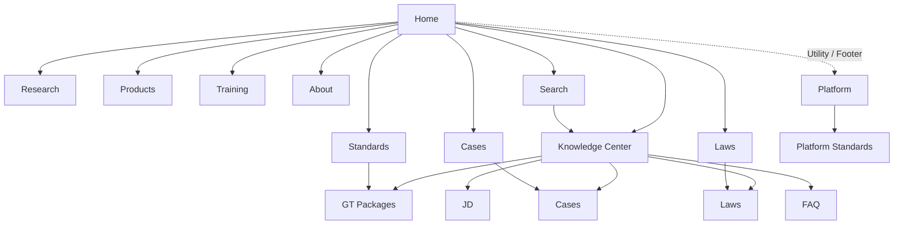
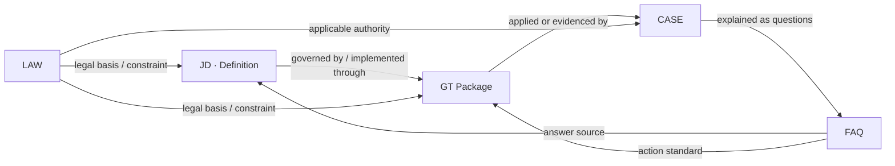

# 《Website Information Architecture V1.1》

> Project: 中国信托制物业发展平台
>
> Task: Codex No.020
>
> Document Type: Website MVP Architecture
>
> Version: V1.1
>
> Date: 2026-07-16
>
> Status: in_review
>
> Owner: Platform Engineering Center
>
> Approver: Chief Architect
>
> Architecture Decision: [ADR-001：Standards Information Architecture](adr/ADR-001-standards-information-architecture.md)
>
> Supersedes: Website Information Architecture V1.0

## 1. 文档定位

本文定义 Website MVP 的目标信息架构，包括 Sitemap V2.0、导航、Knowledge Center、搜索、URL 与 SEO 信息架构。它只定义网站如何组织已批准的平台对象，不创建页面、不改变知识内容，也不改变 Knowledge Foundation Engine、Manifest 或生命周期标准。

V1.1 已应用 ADR-001：GT Package 的唯一栏目是 `/standards/`；平台建设标准的唯一栏目是 `/platform/standards/`。两类标准不得共享 Collection、详情路径、Breadcrumb 或 Sitemap 分组。

本文在 Architecture Approved 前属于目标架构建议，不替换现行 `PLATFORM_IA_V1`，不直接触发路由迁移。历史路径的重定向、Canonical 切换和导航上线必须在后续独立 Engineering PR 中实施和验证。

## 2. IA 原则与边界

1. **对象优先**：栏目服务于 Knowledge Object，不以临时活动或视觉模块组织长期 URL。
2. **一对象一 Canonical**：一个公开对象只有一个权威详情 URL，聚合页只链接到该地址。
3. **发布状态优先**：公开索引默认只包含允许公开发布的 Approved 对象；Candidate、draft、in_review 与内部治理文件不得因建站自动公开。
4. **稳定标识优先**：详情路径使用稳定 Object ID，不把标题、城市名或中文展示标签作为关系键。
5. **聚合与归属分离**：Knowledge Center 提供跨对象发现；各对象仍在自己的 Canonical 栏目下发布。
6. **关系驱动**：JD、GT Package、CASE、LAW、FAQ 通过 Foundation Relationship 连接，不在页面层复制关系数据。
7. **渐进实施**：当前有效 URL 在迁移期保持可访问；目标 URL 获批后再建立永久重定向。
8. **无数据不造数**：空栏目显示范围、收录规则与空状态，不增加 Mock 或未批准对象。

## 3. Sitemap V2.0

```text
/
├── knowledge/                         Knowledge Center（跨类型聚合）
│   ├── jd/                            JD 治理词典目录
│   │   └── {object-id}/               JD 详情
│   ├── topics/                        主题聚合目录
│   │   └── {topic-slug}/              主题聚合页
│   └── relations/                     关系浏览入口（非 MVP 页面，预留）
├── standards/                         GT Package 标准库
│   ├── {package-id}/                  GT Package 详情
│   │   └── {member-id}/               Rule / Method / Principle / Evidence 锚定成员
│   └── topics/{topic-slug}/           标准主题聚合（非 MVP 页面，预留）
├── cases/                             CASE 案例库
│   └── {object-id}/                   CASE 详情
├── laws/                              LAW 法规库
│   └── {object-id}/                   LAW 详情
├── faq/                               FAQ 问答库
│   └── {object-id}/                   FAQ 详情
├── research/                          RESEARCH 研究目录
│   └── {object-id}/                   RESEARCH 详情
├── products/                          产品入口
│   ├── books/                         图书
│   ├── software/                      软件
│   └── toolkits/                      工具产品
├── training/                          培训入口
│   ├── programs/                      培训项目
│   ├── courses/                       专题课程
│   └── learning-paths/                学习路径
├── platform/                          平台建设与治理信息
│   └── standards/                     平台建设标准目录
│       └── {standard-slug}/           平台建设标准详情
├── about/                             关于平台
│   ├── mission/                       使命与定位
│   ├── methodology/                   知识方法与来源治理
│   ├── contributors/                  共建参与方
│   └── contact/                       联系方式
└── search/                            全站搜索结果页
```

说明：`relations/` 与各类 `topics/` 是 IA 预留，不进入 Website MVP 当前开发范围。产品与培训在 MVP 中只承担已批准信息的目录入口，不引入交易、账号、报名或学习系统。

## 4. 页面 IA Registry

| 页面族 | 页面目的 | 目标用户 | Primary Entity | Required Data | Empty State | 导航入口 | URL Filters | MVP |
| --- | --- | --- | --- | --- | --- | --- | --- | --- |
| Home `/` | 解释平台并提供核心入口 | 所有访客与搜索系统 | WebSite / Organization | 栏目入口、已发布对象摘要、搜索入口 | 保留平台说明与栏目入口，不伪造数量 | Brand / 首页 | 无 | 是 |
| Knowledge `/knowledge/` | 跨 JD、GT Package、CASE、LAW、FAQ 发现知识 | 业主、社区、物业、研究者 | CollectionPage | Approved 对象索引、类型、主题、关系 | 说明当前没有匹配对象 | 一级导航 | `q`, `type`, `topic`, `source`, `sort`, `page` | 是 |
| JD `/knowledge/jd/` | 浏览基础定义与治理词典 | 概念查询用户、AI 检索 | JD Collection | JD 元数据、定义、主题、关系 | 说明尚无公开 JD | Knowledge 二级导航 | `q`, `topic`, `source`, `sort`, `page` | 是 |
| JD Detail | 提供一个 JD 的权威引用页 | 知识使用者、AI 系统 | JD | Object ID、定义、正文、来源、版本、更新时间、关系 | 未发布或不存在返回 404 | JD 列表、搜索、关系链接 | 无 | 是 |
| Standards `/standards/` | 按 Package 浏览公开治理标准 | 实践者、审核者、研究者 | GT_PACKAGE Collection | Package ID、版本、目的、范围、children、Evidence、关系 | 说明尚无 Approved Package | 一级导航 | `q`, `topic`, `member`, `sort`, `page` | 是 |
| GT Package Detail | 以完整标准包呈现规则、方法、原则与证据 | 实践者、机构、AI 系统 | GT_PACKAGE | Package 元数据、children、版本、来源、关系 | 未发布或不存在返回 404 | Standards、JD/CASE 关系链接 | 无 | 是 |
| Cases `/cases/` | 浏览可复盘实践案例 | 社区、物业、研究者 | CASE Collection | CASE 元数据、主题、地区展示字段、相关标准 | 说明尚无公开案例 | 一级导航 | `q`, `topic`, `region`, `sort`, `page` | 是 |
| Case Detail | 呈现单个案例及其知识关系 | 实践者、研究者 | CASE | 背景、过程、结果、Evidence、关联 JD/Package/LAW/FAQ | 不存在返回 404 | Cases、关系链接 | 无 | 是 |
| Laws `/laws/` | 浏览与知识对象关联的法规依据 | 实践者、研究者、公众 | LAW Collection | 法规名称、层级、发布机关、效力状态、日期、关系 | 说明尚无法规对象 | 一级导航 | `q`, `level`, `authority`, `status`, `year`, `page` | 是 |
| Law Detail | 提供法规元数据、来源与关联解释入口 | 法规查询用户、AI 系统 | LAW | Object ID、官方标题、来源链接、效力与日期、关联对象 | 不存在返回 404 | Laws、对象关系 | 无 | 是 |
| FAQ `/faq/` | 以问题路径连接权威对象 | 首次访问者、搜索用户 | FAQ Collection | 问题、简答、关联 JD/Package/CASE/LAW | 说明尚无公开 FAQ | Knowledge 二级入口、Footer | `q`, `topic`, `audience`, `page` | 是 |
| FAQ Detail | 回答一个明确问题并提供依据链 | 问题型搜索用户、AI 系统 | FAQ | 问题、答案、来源、更新时间、关联对象 | 不存在返回 404 | FAQ、搜索、相关对象 | 无 | 是 |
| Research `/research/` | 发布研究成果与专题分析 | 政府、行业、研究者、媒体 | RESEARCH Collection | 摘要、作者/机构、日期、主题、来源、关系 | 展示研究范围和空状态 | 一级导航 | `q`, `topic`, `year`, `author`, `page` | 是 |
| Research Detail | 呈现单项研究成果 | 专业用户、AI 系统 | RESEARCH | 摘要、正文、作者、版本、Evidence、关联对象 | 不存在返回 404 | Research、关系链接 | 无 | 是 |
| Products `/products/` | 汇总已批准产品入口 | 有明确工具或产品需求者 | Product Collection | 产品分类、公开状态、说明、目标用户 | 展示产品范围，不创建占位商品 | 一级导航 | `type` | 是（目录） |
| Training `/training/` | 汇总已批准培训与学习入口 | 从业者、机构 | Course / Program Collection | 项目类型、适用人群、状态、入口 | 展示培训范围，不伪造课程 | 一级导航 | `type`, `audience` | 是（目录） |
| Platform `/platform/` | 提供平台建设、治理与公开工程信息入口 | 协作者、审核者、研究者 | Platform | 已批准的平台公开信息入口 | 保留平台说明，不展示内部草稿 | Footer / Utility Navigation | 无 | 是（目录） |
| Platform Standards `/platform/standards/` | 发布可公开的平台建设标准 | 协作者、审核者 | Platform Standard Collection | 标题、版本、状态、摘要、批准信息 | 说明尚无可公开平台标准 | Platform 二级导航 / Footer | `status`, `topic` | 是 |
| Platform Standard Detail | 阅读单个平台建设标准 | 协作者、审核者 | Platform Standard | 标题、版本、状态、正文、批准信息、更新时间 | 未公开或不存在返回 404 | Platform Standards | 无 | 是 |
| About `/about/` | 解释组织、使命、知识治理与参与方式 | 公众、合作方、媒体 | Organization | 平台定位、治理说明、来源方法、联系方式 | 保留基本组织说明 | 一级导航 / Footer | 无 | 是 |
| Search `/search/` | 返回跨栏目可公开结果 | 所有访客 | SearchResultsPage | 查询、结果、类型、摘要、路径、匹配原因 | 给出可调整的搜索建议 | 全站搜索 | 见第 8 节 | 是 |

## 5. 导航结构

### 5.1 一级导航

```text
Brand（返回 Home）
Knowledge
Standards
Cases
Laws
Research
Products
Training
About
Search（全站工具入口）
```

FAQ 的 Canonical 是一级目录 `/faq/`，但在导航认知上归入 Knowledge 的二级入口，同时在 Footer 和搜索结果中提供固定入口，避免主导航同时承载过多同级项目。

主导航 `Standards` 始终指向 `/standards/`，语义只代表 GT Package。`Platform` 属于 Utility Navigation 与 Footer，不与公共知识主导航竞争；其 `Standards` 二级入口指向 `/platform/standards/`，标签必须完整显示为“平台建设标准”。

### 5.2 二级导航

| 一级入口 | 二级入口 |
| --- | --- |
| Knowledge | All Knowledge、JD、GT Packages、Cases、Laws、FAQ、Topics |
| Standards | All Packages、Rules、Methods、Principles、Evidence |
| Cases | All Cases、按主题、按地区（展示维度） |
| Laws | All Laws、按法规层级、按发布机关、按效力状态 |
| Research | All Research、Topics、Years |
| Products | Books、Software、Toolkits |
| Training | Programs、Courses、Learning Paths |
| Platform（Utility / Footer） | Platform Standards |
| About | Mission、Methodology、Contributors、Contact |

二级导航中的类型或主题可以是带查询参数的集合视图，不要求为每个筛选建立实体页面。只有具备独立、稳定搜索意图并通过 Architecture Review 的聚合项才可升级为静态路径。

### 5.3 Navigation Map



### 5.4 Breadcrumb 规则

1. 所有详情页必须从 Home 开始，当前页不可链接。
2. Breadcrumb 表达 Canonical 层级，不表达用户临时访问路径。
3. 筛选参数不进入 Breadcrumb；筛选结果仍指向所属 Collection。
4. GT Package 成员不是独立顶层对象时，必须经过 Package 层。
5. Breadcrumb UI 与 `BreadcrumbList` 结构化数据使用同一层级。
6. `Standards` 表示 GT Package；平台标准的 Breadcrumb 必须完整显示 `Platform > Platform Standards`，不得省略 Platform 层。

示例：

```text
Home > Knowledge > JD > BK1-JD-003
Home > Standards > GT-P001 > GT-P001-R01
Home > Platform > Platform Standards > Knowledge Object Lifecycle Management V1.0
Home > Cases > CASE-001
Home > Laws > LAW-001
Home > FAQ > FAQ-001
Home > Research > RESEARCH-001
```

## 6. Knowledge Center IA

Knowledge Center 是发现层，不是新的知识类型，也不拥有对象正文。它把 Foundation Registry 中可公开的对象按“类型、主题、关系、来源”组织起来，并始终链接到各对象的 Canonical 页面。

| 对象 | 在 Knowledge Center 中的作用 | Canonical 归属 | 关键关系 |
| --- | --- | --- | --- |
| JD | 解释基础概念，是用户进入知识图谱的常见起点 | `/knowledge/jd/{object-id}/` | Related GT Package / CASE / FAQ / LAW |
| GT_PACKAGE | 把 Rule、Method、Principle、Evidence 作为一个完整标准包呈现 | `/standards/{package-id}/` | Related JD / CASE / FAQ / LAW |
| CASE | 提供实践验证和情境证据 | `/cases/{object-id}/` | Related JD / GT Package / FAQ / LAW |
| LAW | 提供法规来源、效力与适用依据 | `/laws/{object-id}/` | Related JD / GT Package / CASE / FAQ |
| FAQ | 把自然语言问题连接到权威对象 | `/faq/{object-id}/` | Related JD / GT Package / CASE / LAW |

### 6.1 Object Relationship Map



图中箭头表达网站导航语义，不创建新的 Foundation Relationship Kind。网站只消费已经登记的关系；缺失关系显示为空，不由页面推断。

### 6.2 GT Package 层级

```text
GT_PACKAGE (GT-P001)
├── RULE
├── RULE
├── METHOD
├── PRINCIPLE
└── EVIDENCE
```

Package 是 Canonical 聚合对象。成员默认在 Package 详情中作为可定位区段呈现；只有成员具备独立 Object ID、独立发布资格且 Architecture Approved 时，才开放独立成员 URL。不得把 Package 拆成互不关联的碎片标准。

## 7. URL Strategy

### 7.1 规则

1. 路径全小写，使用 ASCII 与 kebab-case；目录统一使用复数英文名。
2. Collection URL 使用尾斜杠作为文档规范形式；实现层应统一 Canonical 风格，避免两种地址均返回 200。
3. 详情段使用小写稳定 Object ID，例如 `bk1-jd-003`、`gt-p001`、`case-001`。
4. Object ID 是路由标识；标题只用于页面标题和展示，不成为关系键。
5. 城市、主题、受众等分类进入查询参数或聚合页，不进入对象主键。
6. 查询参数按固定顺序生成分享地址：`q`, `type`, `topic`, `source`, domain filters, `sort`, `page`。
7. 默认值、空参数、跟踪参数不进入 Canonical。
8. 对象改名不改变 URL；对象归档后保留地址并按发布策略返回归档说明或 `410`，不得静默复用旧 ID。

### 7.2 Canonical 路径表

| Entity | Collection | Detail |
| --- | --- | --- |
| JD | `/knowledge/jd/` | `/knowledge/jd/{object-id}/` |
| GT_PACKAGE | `/standards/` | `/standards/{package-id}/` |
| GT Package Member | Package 内部 | `/standards/{package-id}/{member-id}/`（条件开放） |
| Platform Standard | `/platform/standards/` | `/platform/standards/{standard-slug}/` |
| CASE | `/cases/` | `/cases/{object-id}/` |
| LAW | `/laws/` | `/laws/{object-id}/` |
| FAQ | `/faq/` | `/faq/{object-id}/` |
| RESEARCH | `/research/` | `/research/{object-id}/` |
| Product | `/products/{type}/` | 后续产品架构批准后定义 |
| Training | `/training/{type}/` | 后续产品架构批准后定义 |

### 7.3 当前到目标映射

| Current | Target | 本次处理 |
| --- | --- | --- |
| `/knowledge` | `/knowledge/` | 保持；后续扩展聚合范围 |
| `/knowledge/{id}` | 按类型映射到 JD 或 GT Package Canonical | 仅记录；批准后做永久重定向 |
| `/standards`（当前平台建设标准目录） | `/platform/standards/`；原路径切换为 GT Package | ADR-001 已决策；后续原子迁移 |
| `/standards/{slug}`（平台建设标准） | `/platform/standards/{slug}/` | 批准实施后永久重定向 |
| 新 GT Package | `/standards/{package-id}/` | 只在 Approved 对象存在后发布 |
| `/cases`、`/cases/{id}` | 同目录，详情键统一 Object ID | 保持兼容 |
| `/books` | `/products/books/` | 仅记录；不重定向 |
| 现有课程与成长页面 | `/training/` 或独立产品域 | 等待产品边界批准 |

任何迁移必须同时提交 Redirect Matrix、Canonical 变更、Sitemap 更新、内部链接更新和死链验证，不能只修改导航链接。

## 8. Search Architecture

### 8.1 搜索范围

默认搜索以下已公开对象：

```text
JD + GT_PACKAGE + CASE + LAW + FAQ + RESEARCH
```

索引字段按优先级分层：

1. `object_id`、`title`、`definition/question`；
2. aliases、tags、topic、summary；
3. approved body；
4. source metadata、relationship targets；
5. Package children 的标题与成员类型。

Candidate、draft、in_review、未批准 Evidence、非公开平台标准、后台数据与 archived 正文默认不进入公开搜索索引。已批准且公开的平台建设标准可以进入 `scope=site`，但不进入默认 Knowledge Object 结果，也不冒充 GT Package。Products 与 Training 作为独立站点页面索引，可在“全站”范围出现，但不冒充 Foundation Knowledge Object。

### 8.2 查询参数与筛选

| Parameter | Purpose | Values |
| --- | --- | --- |
| `q` | 用户查询 | UTF-8 文本，展示时安全编码 |
| `scope` | 搜索范围 | `knowledge`（默认）、`site` |
| `type` | 对象分类 | `jd`, `gt-package`, `case`, `law`, `faq`, `research` |
| `topic` | 主题 | 稳定英文 slug，不用中文标签作枚举值 |
| `source` | 来源范围 | 稳定 Source ID |
| `relation` | 与某对象相关 | 稳定 Object ID |
| `level` | LAW 层级 | 经批准的稳定枚举 |
| `authority` | LAW 发布机关 | 稳定 Authority ID |
| `year` | 年份筛选 | 四位年份 |
| `sort` | 排序 | `relevance`（默认）、`updated`, `title` |
| `page` | 分页 | 正整数 |

生命周期不是公共筛选条件；公开搜索以发布资格作为索引门禁。内部审核搜索如未来立项，应使用独立权限与接口，不复用公共 URL 暴露非 Approved 对象。

### 8.3 搜索结果结构

每条结果按相同语义顺序输出：

```text
Object Type + Object ID
Title
Definition / Summary / Answer excerpt
Canonical Breadcrumb
Source + Version + Updated At
Matched field / highlighted term
Related objects（最多显示少量导航入口）
```

无结果时显示：原查询、已应用筛选、清除筛选入口、可用对象类型和拼写建议；不得用推荐内容伪装成命中结果。

### 8.4 排序原则

1. 精确 Object ID；
2. 精确标题或问题；
3. Definition / aliases；
4. 摘要与正文相关度；
5. 关系匹配；
6. 更新时间只作为同等相关度的次级信号。

不得用未定义的“权威分”覆盖生命周期、来源与相关性。

## 9. SEO Information Architecture

### 9.1 Canonical

- Collection、详情和有独立搜索意图的主题页各自声明 Self Canonical。
- 筛选、排序、分页和站内搜索页不得产生无限 Canonical 组合；普通筛选页 Canonical 回 Collection，获批的静态主题页除外。
- 历史 URL 在迁移后使用永久重定向指向唯一 Canonical。
- 同一对象不得在 `/knowledge/` 与专属栏目各生成一份可索引正文。

### 9.2 Hierarchy 与内部链接

```text
Home
→ Object Collection
→ Object Detail
→ Registered Relationships
→ Supporting Evidence / Source
```

每个公开对象必须可从至少一个 Collection 到达；孤立对象不得只依赖 Sitemap 被发现。详情页通过 Registry Relationships 连接相关 JD、GT Package、CASE、LAW 与 FAQ。

### 9.3 Structured Object Mapping

| Website Entity | Schema role | Required linkage |
| --- | --- | --- |
| Home | `WebSite` + `Organization` | Search action、publisher |
| Collection | `CollectionPage` + `ItemList` | Canonical item URLs |
| JD | `DefinedTerm` / `Article` | inDefinedTermSet、citation |
| GT_PACKAGE | `CreativeWork` / `TechArticle` | hasPart、version、citation |
| Platform Standard | `TechArticle` / `CreativeWork` | version、publisher、dateModified |
| CASE | `Article` | about、citation |
| LAW | `Legislation`（数据满足时） | legislationIdentifier、legislationDate、source |
| FAQ | `FAQPage`（页面满足规范时） | Question / acceptedAnswer |
| RESEARCH | `Report` / `Article` | author、publisher、citation |
| Product | `Product`（存在真实产品时） | brand、offers（仅有真实数据时） |
| Training | `Course`（存在真实课程时） | provider、hasCourseInstance（仅有真实数据时） |
| Breadcrumb | `BreadcrumbList` | 与可见 Breadcrumb 一致 |

结构化数据不得补写正文中不存在的主张、评分、价格、作者或批准状态。

### 9.4 XML Sitemap 架构

目标形态是 Sitemap Index，按稳定对象族拆分：

```text
/sitemap.xml
├── /sitemaps/pages.xml
├── /sitemaps/knowledge-jd.xml
├── /sitemaps/standards.xml
├── /sitemaps/platform-standards.xml
├── /sitemaps/cases.xml
├── /sitemaps/laws.xml
├── /sitemaps/faq.xml
└── /sitemaps/research.xml
```

只包含可公开且 Canonical 的 200 页面。搜索结果、筛选组合、后台、Candidate、重定向页、404 与重复详情不得进入 Sitemap。`lastmod` 来自对象 `updated_at` 或批准后的发布记录，不得统一伪造为构建时间。

## 10. Architecture Decision Status

### IA-019-01：`/standards` 语义冲突（Resolved）

ADR-001 已解决该冲突：`/standards/` 只承载 GT Package，`/platform/standards/` 只承载平台建设标准。V1.1 将该决策同步到 Sitemap、Navigation、Breadcrumb、URL、Search 与 SEO Sitemap 分组；实际路由迁移仍由后续 Engineering PR 执行。

### IA-019-02：一级导航基线冲突

现行 `PLATFORM_IA_V1` 的一级导航为“内容中心、制度中心、金牌管家成长世界、产品中心、用户识别与资源连接系统、治理实验室”；No.019 要求以 Knowledge、Standards、Cases、Laws、FAQ、Research、Products、Training、About 建立网站骨架。本文将 No.019 结构作为待审批目标 IA，但不自行废止旧基线。

### IA-019-03：Products / Training 与现有路径归属

当前 `/books`、成长世界、学生页面和课程资产存在多条产品路径。本文只定义 `/products/` 与 `/training/` 的信息归属，不决定商业模型、成长体系或页面迁移。后续应由产品与总架构评审确认 Canonical 边界。

## 11. 后续实施门禁

Architecture Approved 后，Website MVP 的工程实现应按以下顺序进入独立 PR：

1. 批准 URL 与 Redirect Matrix；
2. 建立只读 Repository / View Model，不修改 Foundation；
3. 实现 Collection 与 Detail 路由；
4. 实现导航与 Breadcrumb；
5. 实现公共搜索索引与发布状态门禁；
6. 切换 Canonical、XML Sitemap 与内部链接；
7. 执行 Build、TypeScript、Accessibility、SEO、Redirect 和 dead-link validation。

本文件本身不授权任何上述实现。

## 12. Version Change

V1.1 相对 V1.0 的唯一架构变更是应用 ADR-001：

- 新增 `/platform/standards/` 平台建设标准域；
- 保持 `/standards/` 为 GT Package 域；
- 更新 Sitemap、Navigation、Breadcrumb、URL Strategy、Search Scope 与 XML Sitemap 分组；
- 将 IA-019-01 标记为 Resolved；
- 不改变其它对象、栏目或产品边界。

## 13. No.020 Scope Validation

本次提交只更新 Architecture Document 并新增 ADR-001：

- 不修改 UI、页面或样式；
- 不修改知识对象或知识正文；
- 不修改 Knowledge Foundation Engine；
- 不修改 Manifest；
- 不新增 Mock 数据；
- 不执行 URL 迁移或 Redirect；
- 不修改任何已批准的平台标准正文。

验证结果：

- Production Build: PASS，45/45 static pages generated；
- TypeScript: PASS，`npx tsc --noEmit --pretty false` 无错误；
- Document diff check: PASS；
- Runtime source changes: 0；
- Knowledge / Foundation / Manifest changes: 0。
